[](https://conventionalcommits.org)
[](https://github.com/conventional-changelog/conventional-changelog)
[](https://renovatebot.com/)
[](https://github.com/SchulteMarkus/Sse-BelMngr-Hermine/actions/workflows/build.yml)
[](https://github.com/SchulteMarkus/Sse-BelMngr-Hermine/actions/workflows/test.yml)
[](https://github.com/SchulteMarkus/Sse-BelMngr-Hermine/actions/workflows/lint.yml)
[](https://sonarcloud.io/summary/new_code?id=SchulteMarkus_Sse-BelMngr-Hermine)
[](https://sonarcloud.io/summary/new_code?id=SchulteMarkus_Sse-BelMngr-Hermine)

# SteuerSparErklärung BelegManger Invoice Importer "Hermine"

**Sse-BelMngr-Hermine** is a command-line tool designed to analyze local documents using
[Azure® AI Document Intelligence](https://azure.microsoft.com/en-us/products/ai-services/ai-document-intelligence)
and seamlessly import the processed data into the BelegManager of
[SteuerSparErklärung®](https://www.steuertipps.de).

```mermaid
sequenceDiagram
    participant User as 👤 User
    participant Hermine as 🪄 Sse-BelMngr-Hermine 🪄
    participant AzureAI as Azure® AI Document Intelligence
    participant BelegManager as Sse® BelegManager
    User ->> Hermine: Run for specific local documents
    Hermine ->> AzureAI: Analyze documents
    AzureAI ->> Hermine: Return analyzed data
    Hermine ->> BelegManager: Import documents
```



---

# Table Of Contents

* [🚀 Key Features](#-key-features)
  * [Supported File Types](#supported-file-types)
  * [Advanced Features](#advanced-features)
* [🛠️ Installation](#%EF%B8%8F-installation)
* [🌟 Usage](#-usage)
  * [Command-Line Quickstart](#command-line-quickstart)
  * [Command-Line Flags](#command-line-flags)
* [⚙️ Configuration File](#%EF%B8%8F-configuration-file)
* [🎯 Workflow](#-workflow)
* [📝 Examples](#-examples)
  * [Example Run](#example-run)
  * [Outcome](#outcome)
* [🛡️ Error Handling](#%EF%B8%8F-error-handling)
* [🖥️ Project Structure](#%EF%B8%8F-project-structure)
* [📚 Dependencies](#-dependencies)
* [📜 Disclaimer](#-disclaimer)
* [💬 Feedback](#-feedback)
* [🎨 Project Name Inspiration](#-project-name-inspiration)

---

## 🚀 Key Features

- **Document Analysis**  
  Harnesses Azure AI Document Intelligence to extract information (vendor, total, VAT, etc.) from
  PDF, JPG, PNG, TIF/TIFF documents.

- **Smooth Import**  
  Effortlessly imports processed documents into the BelegManager tool.

- **Flexible Configuration**  
  Integrates seamlessly with command-line arguments, environment variables, and configuration files.

- **Custom File Selection**  
  Uses glob patterns to filter and choose only the files you need for analysis.

- **Robust Logging**  
  Configurable logging levels—from detailed debug logs to concise summaries.

### Supported File Types

- **Input Files**: `jpg`, `pdf`, `png`, `tif`, `tiff`.
- **Document Intelligence Compatible Types**: Includes additional types like `jfif`, `jp(e)g`, and
  more.

### Advanced Features

- **Data Backup**:
  Automatically backs up the BelegManager SQLite database before processing.

- **Parallel File Processing**:
  Supports concurrent processing of multiple files for efficiency.

- **Error Handling**:
  Gracefully handles missing files, invalid configurations, and failed imports.

---

## 🛠️ Installation

1. **Prerequisites**
    - Go (Golang) SDK 1.23 or later.
    - An Azure Cognitive Services account with Document Intelligence enabled.
      - `DI_KEY` and `DI_ENDPOINT` available as described on 
        [Azure Documentation 'Use Document Intelligence models' -> Prerequisites](https://learn.microsoft.com/en-us/azure/ai-services/document-intelligence/how-to-guides/use-sdk-rest-api?view=doc-intel-4.0.0&tabs=windows&pivots=programming-language-rest-api#prerequisites).

2. **Install Application**

```shell
go install github.com/SchulteMarkus/sse-belmngr-hermine@latest
```

## 🌟 Usage

### Command-Line Quickstart

```shell
sse-belmngr-hermine --di-key <Azure_AI_key> --di-endpoint <Azure_AI_endpoint>
```

### Command-Line Flags

| Flag                             | Shorthand | Description                                                                                                                             | Required | Default Value                                                                                 |
|----------------------------------|-----------|-----------------------------------------------------------------------------------------------------------------------------------------|----------|:----------------------------------------------------------------------------------------------|
| `--config`                       | `-c`      | Path to the configuration file (optional).                                                                                              | No       | *None*                                                                                        |
| `--di-key`                       |           | Azure Document Intelligence API key. Use this to authenticate against Azure services.                                                   | Yes      | *None*                                                                                        |
| `--di-endpoint`                  |           | Azure Document Intelligence endpoint URL.                                                                                               | Yes      | *None*                                                                                        |
| `--files-to-import-glob`         | `-f`      | Glob pattern to locate the input document files (supports wildcards). Defaults to user documents directory under `BelegManager-Import`. | No       | C:/Users/`your-user-name`/Documents/Documents/BelegManager-Import/**/*.{jpg,pdf,png,tif,tiff} |
| `--beleg-manager-data-directory` |           | Specify the root directory for BelegManager data (default: the `Documents/BelegManager-Daten` folder in the user's home directory).     | No       | C:/Users/`your-user-name`/Documents/BelegManager-Daten                                        |
| `--log-level`                    | `-l`      | Specify the logging level (trace, debug, info, warn, error, fatal, panic). Defaults to `info`.                                          | No       | info                                                                                          |

---

## ⚙️ Configuration File

Optionally, you can manage settings via a configuration file (e.g., `config.yml`):

```yaml
di-key: "your-azure-ai-key"
di-endpoint: "https://<your-endpoint>.cognitiveservices.azure.com/"
files-to-import-glob: "C:/Users/<your-user-name>/Documents/BelegManager-Import/**/*.pdf"
beleg-manager-data-directory: "C:/Users/<your-user-name>/Documents/BelegManager-Daten"
log-level: "debug"
```

Then run:

```shell
sse-belmngr-hermine -c config.yaml
```

---

## 🎯 Workflow

1. **Analyze Documents**
    - Scans local files using the specified `--files-to-import-glob`.
    - Extracts invoice data (vendor, total, VAT, items) via Azure AI Document Intelligence.

2. **Process Data**
    - Validates database compatibility.
    - Structures and readies extracted info for BelegManager.

3. **Import to BelegManager**
    - Inserts discovered information into the BelegManager database.
    - Creates a backup of the BelegManager database before any changes.

4. **Logging & Summaries**
    - Outputs a processed file report (CSV) detailing import status for each document.

---

## 📝 Examples

### Example Run

```shell
sse-belmngr-hermine run \
  --files-to-import-glob "~/Documents/BelegManager-Import/**/*.pdf" \
  --beleg-manager-data-directory "~/Documents/BelegManager-Daten" \
  --di-key "<your-azure-ai-key>" \
  --di-endpoint "<your-azure-ai-endpoint>" \

INFO[09:55:21] New Beleg created  beleg_id=123  beleg_name="Caffè from somewhere" file_to_import_base_name="cafe1.pdf" file_to_import_full_path="C:\\Users\\<your-user-name>\\Documents\\BelegManager-Import\\cafe1.pdf"
INFO[09:55:23] Beleg updated      beleg_id=77   beleg_name="Caffè from somewhere" file_to_import_base_name="cafe2.pdf" file_to_import_full_path="C:\\Users\\<your-user-name>\\Documents\\BelegManager-Import\\cafe2.pdf"
INFO[09:55:23] Wrote CSV log file C:\Users\<your-user-name>\Documents\BelegManager-Daten\_import-log-20250127095523.csv 
```

### Outcome

- Documents are imported and linked in BelegManager.
- A CSV log file is generated with status and any encountered errors:

```shell
cat ~/Documents/BelegManager-Daten/_import-log-<timestamp>.csv

OriginalPath, BelegID, BelegName, BelegDate, InvoiceTotal, InvoiceTotalConfidence, VatRate
C:\Users\<your-user-name>\Documents\BelegManager-Import\cafe1.pdf, 123, Caffè from somewhere, 2024-08-08, 12.00, 12.00, 0.84, 7.00
C:\Users\<your-user-name>\Documents\BelegManager-Import\cafe2.pdf,  77, Caffè from somewhere, 2024-05-29, 12.00, 12.00, 0.84, 7.00
```

---

## 🛡️ Error Handling

- **Missing Database**: Alerts if the BelegManager database is not found.
- **Unsupported Document**: Skips files if format mismatches or duplicates exist.
- **Azure Failures**: Employs retries and logs any network or API issues.

---

## 🖥️ Project Structure

- [cli](cli): Houses CLI logic such as flag handling and command execution.
- [hermine](hermine): Contains the core functionality for document analysis and database
  interactions.

---

## 📚 Dependencies

This application makes use of the following key libraries/packages:

- [Cobra](https://github.com/spf13/cobra) for CLI command building.
- [Viper](https://github.com/spf13/viper) for configuration management.
- [Logrus](https://github.com/sirupsen/logrus) for structured logging.
- [sqlx](https://github.com/jmoiron/sqlx) for database querying.
- [doublestar](https://github.com/bmatcuk/doublestar) for glob pattern matching.
- [Azure® AI Document Intelligence](https://azure.microsoft.com/en-us/products/ai-services/ai-document-intelligence)
  for document analysis.

---

## 📜 Disclaimer

This software is currently in the test phase. No further liability is assumed. Use at your own risk.

---

## 💬 Feedback

If you have any questions, issues, or suggestions, feel free to open an issue in
the [GitHub Issues Section](https://github.com/SchulteMarkus/Sse-BelMngr-Hermine/issues).

--- 

## 🎨 Project Name Inspiration

Project name "Hermine" is inspired by the resourceful and knowledgeable character
[Hermione Granger](https://en.wikipedia.org/wiki/Hermione_Granger) from the Harry
Potter® series.
